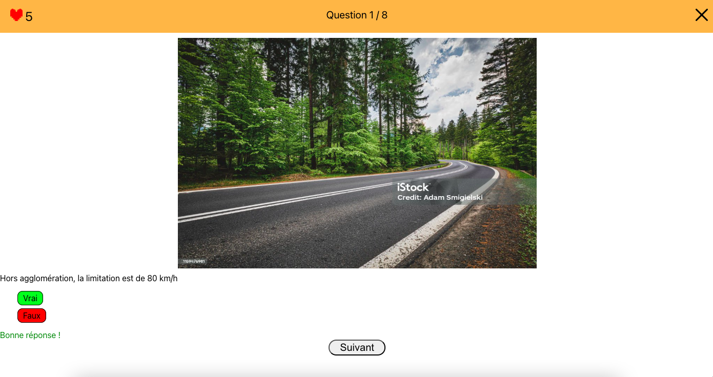
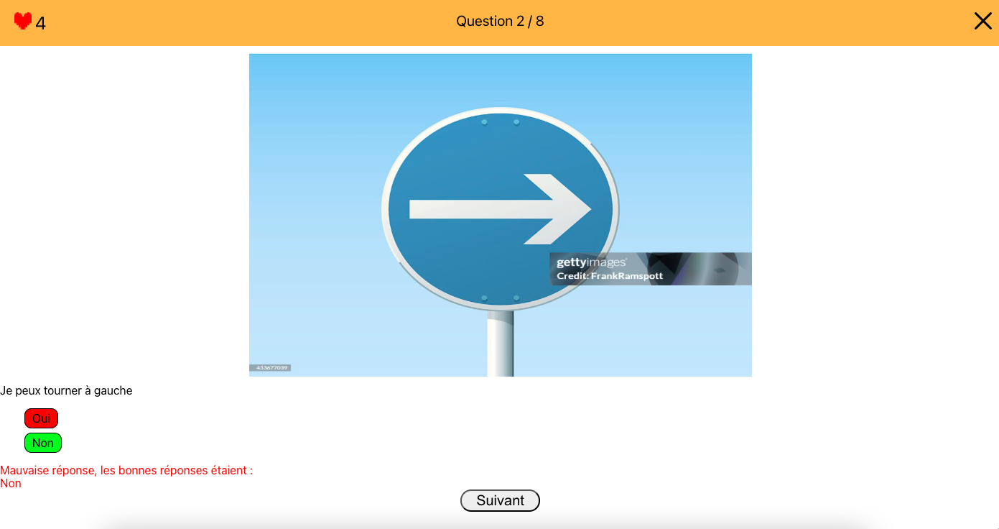
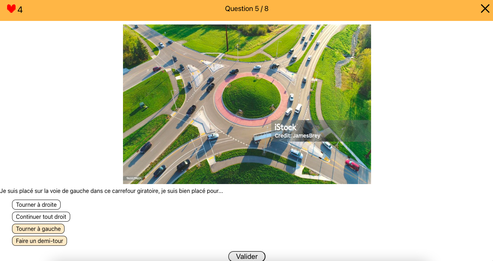

# UNOCODIGO

Quiz reprenant des questions du code de la route. Plusieurs réponses sont possibles.

## Run the Project

This project was bootstrapped with [Create React App](https://github.com/facebook/create-react-app).

In the project directory, you can run:

### `yarn start`

Open [http://localhost:3000](http://localhost:3000) to view it in your browser.

## Crédits
<a href="https://www.flaticon.com/fr/icones-gratuites/bouton-de-fermeture" title="bouton de fermeture icônes">Bouton de fermeture icônes créées par Yuju - Flaticon</a>